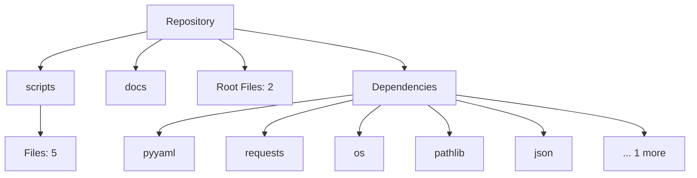

# Autonomous Repository

This repository is self-documenting and self-maintaining. It uses GitHub Actions, repository bots, and AI agents to continuously analyze, document, and explain itself.

## Project Overview (AI Generated)
This repository contains 7 files across 7 directories.

### Architecture Overview
The project is structured with standard directories. Dependencies are managed via standard package files. This summary is auto-generated by the AI Documentation Agent based on the latest codebase scan.

## Architecture Diagram

## Technology Stack

**Detected Frameworks:**
- Standard libraries/Unknown

**Key Dependencies:**
- pyyaml
- requests
- os
- pathlib
- json
- ast

## Key Features
- Autonomous repository scanning and mapping
- AI-powered documentation generation
- Interactive architecture diagrams
- Automated CI/CD, linting, and security scanning
- Automated changelog and release generation

## System Architecture
This project utilizes a collection of Python scripts executed via GitHub Actions to generate a `.json` structural map, an interactive `vis.js` visualization, and an AI-summarized Markdown file, which are then combined into this README.

## Repository Structure

Automatically mapped knowledge graph is available at `scripts/diagrams/knowledge_graph.json`.

## Setup Instructions

1. Clone the repository.
2. Install dependencies listed above.
3. Run standard build commands based on your framework.

## Deployment Instructions
The system deploys documentation artifacts continuously via GitHub Actions directly to the repository using Git commit automation.

## API Documentation
Currently internal-only Python API for automation scripts. See `repo_analyzer.py` for extraction logic.

## Environment Variables
- `OPENAI_API_KEY`: Required for the AI Documentation Agent to summarize changes and PR reviews. If not provided, a fallback local script is used.

## Changelog Summaries
View the latest releases in the "Releases" sidebar on GitHub for auto-generated changelogs.

## Contribution Guide

When you push changes, the repository will automatically:
1. Scan the new structure.
2. Update the knowledge graph and diagrams.
3. Generate AI summaries.
4. Commit the updated README back to the repository.

Please do not edit this README directly! It is auto-generated on every build.
