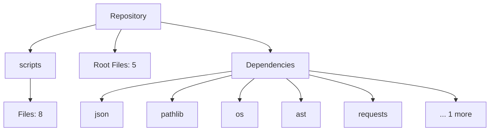

# Autonomous Repository

This repository is self-documenting and self-maintaining. It uses GitHub Actions, repository bots, and AI agents to continuously analyze, document, and explain itself.

## Project Overview (AI Generated)
This repository contains 13 files across 4 directories.

### Architecture Overview
The project is structured with standard directories. Dependencies are managed via standard package files. This summary is auto-generated by the AI Documentation Agent based on the latest codebase scan.

## Architecture Diagram

## Technology Stack

**Detected Frameworks:**
- Standard libraries/Unknown

**Key Dependencies:**
- json
- pathlib
- os
- ast
- requests
- pyyaml

## Repository Structure

Automatically mapped knowledge graph is available at `scripts/diagrams/knowledge_graph.json`.

## Setup Instructions

1. Clone the repository.
2. Install dependencies listed above.
3. Run standard build commands based on your framework.

## Contribution Guide

When you push changes, the repository will automatically:
1. Scan the new structure.
2. Update the knowledge graph and diagrams.
3. Generate AI summaries.
4. Commit the updated README back to the repository.

Please do not edit this README directly! It is auto-generated on every build.
